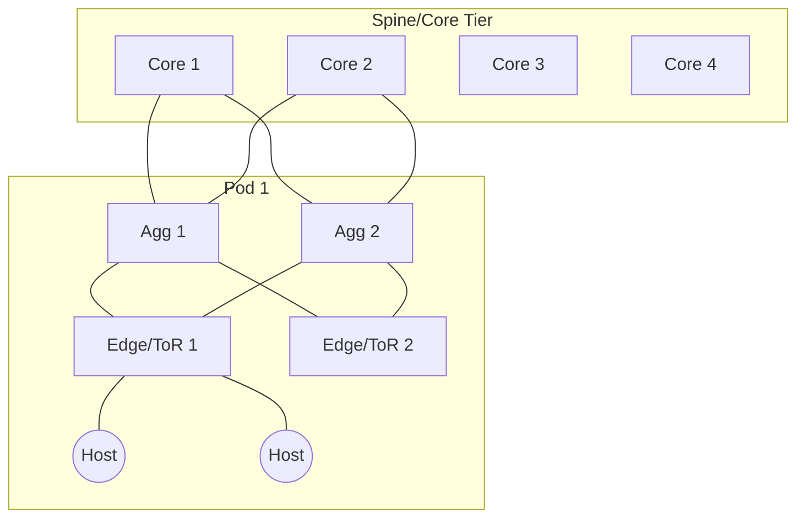
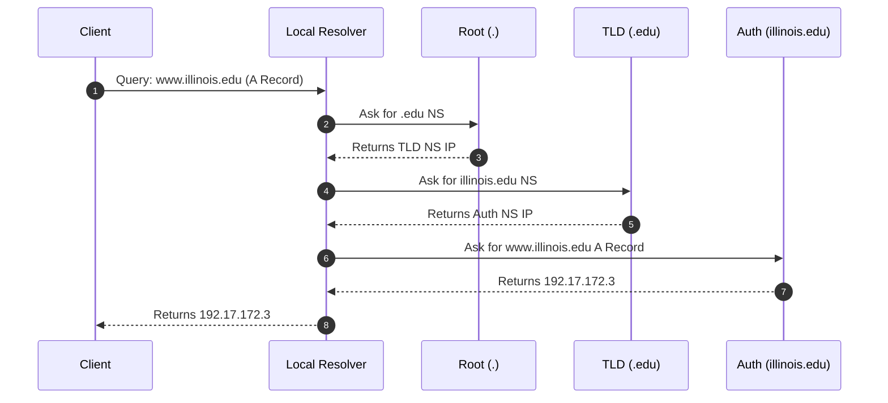
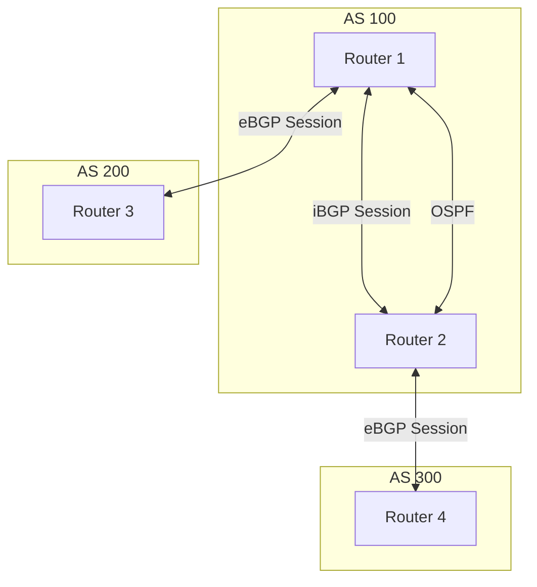
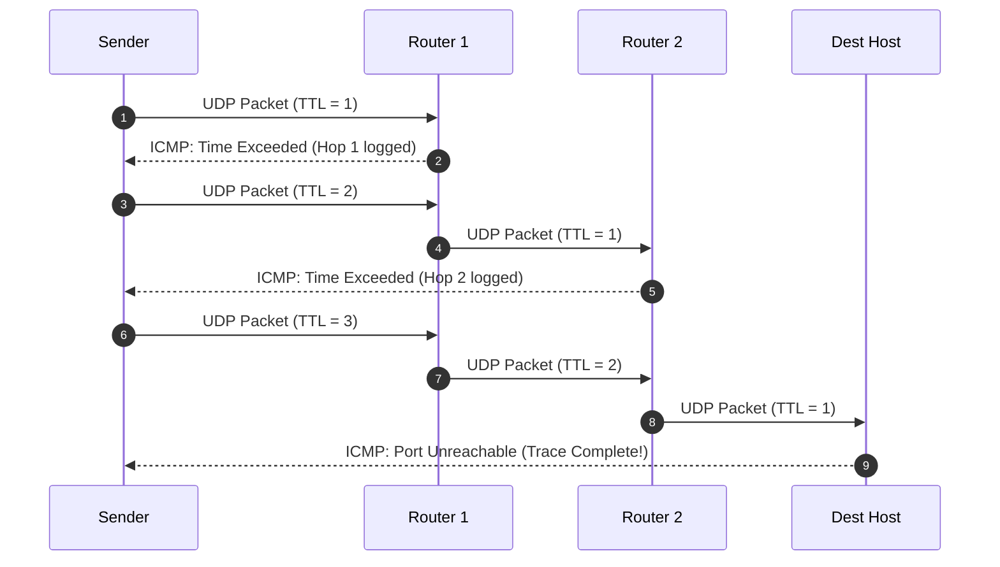

---

## 1. Network Math, Unit Conversions & Delays

### 1.1 Base Math & Units
* **Network Speeds (Base-10):** 1 Kbps = $10^3$ bps | 1 Mbps = $10^6$ bps | 1 Gbps = $10^9$ bps
* **Storage/Data (Base-2):** 1 Byte (B) = 8 bits (b)
* **Quick Conversion:** `Mbps / 8 = MB/s`. (e.g., 100 Mbps = 12.5 MB/s).
* **Transmission Time of a Packet:**
    * *Formula:* $d_{trans} = \frac{L}{R}$ (L = bits, R = bps)
    * *Example:* 64-byte packet over 40 Gbps link $\rightarrow \frac{64 \times 8}{40 \times 10^9} = 12.8 \text{ ns}$.

### 1.2 Delay & Utilization Formulas
* **Propagation Delay ($d_{prop}$):** $d_{prop} = \frac{D}{S}$
    * *D* = distance (meters). *S* = speed of medium ($\approx 2 \times 10^8$ m/s for fiber).
* **Total Nodal Delay:** $d_{nodal} = d_{proc} + d_{queue} + d_{trans} + d_{prop}$
* **Bandwidth-Delay Product (BDP):** Volume of data required to keep a link 100% full.
    * $BDP \text{ (bits)} = \text{Bandwidth (bps)} \times \text{RTT (sec)}$
    * *Divide by 8* to determine the necessary TCP Receiver Window Size (in Bytes) for maximum utilization.

### 1.3 MTU & IP Fragmentation Math
* **Standard Ethernet MTU:** 1500 bytes.
* **Max Segment Size (MSS):** MTU - (IP Header + TCP Header). Standard MSS = 1500 - 20 - 20 = **1460 bytes**.
* **IP Fragmentation Offset:** Used to reassemble fragmented packets. 
    * *Rule:* Offset is measured in **8-byte blocks**.
    * *Formula:* $\text{Offset Value} = \frac{\text{Byte offset of data}}{8}$

---

## 2. Packet Headers: Fields & Functions

### 2.1 IPv4 Header (20 Bytes minimum)
| Field | Size | Function / Description |
| :--- | :--- | :--- |
| **Version/IHL** | 4b/4b | IPv4 (4). IHL specifies header length in 32-bit words (Standard = 5 words = 20 Bytes). |
| **ToS (Type of Service)**| 8 bits | Differentiated services / ECN bits (used by DCTCP). |
| **Total Length** | 16 bits | Size of entire packet (header + payload) in bytes. |
| **Identification** | 16 bits | Unique ID for fragmented packets. |
| **Flags** | 3 bits | DF (Don't Fragment), MF (More Fragments). |
| **Fragment Offset**| 13 bits | Position of fragment in original payload (in 8-byte units). |
| **TTL (Time to Live)** | 8 bits | Decrements every hop. Drops at 0. **Used by Traceroute**. |
| **Protocol** | 8 bits | Upper layer protocol: ICMP(1), TCP(6), UDP(17). |
| **Header Checksum**| 16 bits | Verifies header integrity (not payload). |
| **Source / Dest IP** | 32b/32b | Logical $L3$ routing addresses. |

### 2.2 TCP Header (20 Bytes minimum)
| Field | Size | Function / Description |
| :--- | :--- | :--- |
| **Source/Dest Port** | 16b/16b | Multiplexing identifiers for application processes. |
| **Sequence Number** | 32 bits | Byte offset of the first byte of data in this segment. |
| **Acknowledgment No.**| 32 bits | The *next* byte the receiver expects to receive. |
| **Header Len / Flags**| 4b/12b | SYN, ACK, FIN, RST, PSH, URG. |
| **Window Size** | 16 bits | Flow control: Receiver Window Size (RWS) - bytes willing to accept. |
| **Checksum / Urgent** | 16b/16b | Error checking across header and payload. |

### 2.3 UDP Header (8 Bytes)
* **Fields:** Source Port (16b), Dest Port (16b), Length (16b), Checksum (16b).
* **Properties:** Connectionless, no flow/congestion control, ultra-low overhead. Used for DNS, NTP, and real-time streaming.

---

## 3. Network Architecture & Routing Algorithms

### 3.1 Data Plane vs. Control Plane
* **Data Plane (The Muscle):** Nanosecond timescale. ASIC hardware. Parses headers, performs longest prefix match (LPM), and forwards packets to output ports.
* **Control Plane (The Brain):** Millisecond to minute timescale. General-purpose CPUs. Runs routing algorithms (OSPF, BGP) to populate the Data Plane's forwarding tables (FIB).

### 3.2 Inside the Switch: Queuing
* **Input Queuing:** Suffers from **Head-of-Line (HoL) blocking** (blocked packet at front prevents remaining packets from moving).
* **Output Queuing:** Solves HoL blocking but requires the switch fabric to run $N \times$ faster than the links.

### 3.3 Routing Algorithms
#### Link State (e.g., OSPF)
* **Mechanism:** Floods local link state to the *global* network. Every node builds a full graph and runs Dijkstra.
* **Dijkstra's Time Complexity:** $O((n+m) \log n)$ where $n=$ nodes, $m=$ edges (using a priority queue).

#### Distance Vector (e.g., RIP, EIGRP)
* **Mechanism:** Shares global (best-known) distances with *local* neighbors.
* **Bellman-Ford Equation:** $$D(w) = \min_n \{ c(v,n) + M_n(w) \}$$
    *(Distance to w = minimum over all neighbors n of cost to n + n's reported distance to w)*.

#### Border Gateway Protocol (BGP)
* **Type:** Path Vector (shares full AS path to prevent loops).
* **Policy Routing:** Best route chosen via local policy, NOT shortest path. Priority order:
    1. Highest **LocalPref** (determines outbound traffic path).
    2. Shortest **AS-Path** length.
    3. Lowest MED (Multi-Exit Discriminator).
    4. eBGP over iBGP.

---

## 4. Transport Layer: Sliding Windows & Congestion

### 4.1 Sliding Window Math
* **SWS (Sender Window Size):** Max un-ACKed data in flight.
* **RWS (Receiver Window Size):** Max out-of-order data buffer.
* **Sequence Number Space Rule:** To prevent wrapping overlap bugs, the total sequence numbers available must be:
    $$\text{SeqNum Space} \ge SWS + RWS$$

### 4.2 TCP Congestion Control
TCP uses packet loss as the primary signal of congestion.
1.  **Slow Start:** Congestion Window (`cwnd`) starts at 1 MSS.
    * *Equation:* `cwnd` doubles every RTT. (+1 MSS per ACK received).
2.  **AIMD (Additive Increase, Multiplicative Decrease):** * *Additive Increase (No loss):* $cwnd \leftarrow cwnd + 1 \text{ MSS per RTT}$
    * *Multiplicative Decrease (Loss):* $cwnd \leftarrow \frac{cwnd}{2}$

### 4.3 TCP Incast & Data Center TCP (DCTCP)
* **TCP Incast:** Sudden buffer overflow when many workers send data simultaneously to a single aggregator (Scatter-Gather workload). TCP severely underperforms due to timeout delays.
* **DCTCP Solution:** Uses ECN (Explicit Congestion Notification). Instead of halving the window blindly, DCTCP cuts the window proportionally to the *fraction* of congestion.
* **DCTCP Alpha ($\alpha$) Calculation:**
    $$\alpha \leftarrow (1 - g) \times \alpha + g \times F$$
    *(g = weight factor, F = fraction of marked ECN packets in the window)*
* **DCTCP Window Decrease:**
    $$cwnd \leftarrow cwnd \times \left(1 - \frac{\alpha}{2}\right)$$

### 4.4 Cloud Workloads & Tail Latency

Scale magnifies tail latency. If one task out of thousands is slow, the entire job is delayed.
* Let **$p$** = Probability a single task finishes on time (e.g., $\le 42$ms).
* Let **$q$** = Probability a single task is slow ($1 - p$).
* Let **$n$** = Number of parallel tasks in the job.

**Probability the entire job is delayed (fails deadline):**
$$Pr[\text{Job} > 42\text{ms}] = 1 - p^n$$

**Probability that exactly $k$ out of $n$ original requests fail the timer:**
$$P(X = k) = \binom{n}{k} \cdot q^k \cdot p^{n-k}$$
*Where "n choose k" is calculated as:*
$$\binom{n}{k} = \frac{n!}{k!(n - k)!}$$

**Probability of $x$ or more failures:**
$$P(X \ge x) = 1 - \sum_{k=0}^{x-1} P(X = k)$$

---

## 5. Data Center Topology: Fat-Tree / Clos

Legacy tree networks have severe oversubscription for "East-West" (server-to-server) traffic. Modern DCs use non-blocking Clos networks (Fat-Trees) to provide 1:1 bandwidth via Equal Cost Multi-Path (ECMP).

### 5.1 $K$-Port Fat-Tree Formulas
Given a 3-tier topology where every switch has **$k$ ports**:

| Metric | Formula |
| :--- | :--- |
| **Number of Pods** | $k$ |
| **Edge (ToR) Switches per Pod** | $\frac{k}{2}$ |
| **Agg Switches per Pod** | $\frac{k}{2}$ |
| **Total Core Switches** | $\left(\frac{k}{2}\right)^2$ |
| **Total Switches in Network** | $\frac{5k^2}{4}$ |
| **Total Hosts Supported** | $\frac{k^3}{4}$ |
| **ECMP Paths between pods** | $\left(\frac{k}{2}\right)^2$ |

### 5.2 Clos Architecture Diagram

---

## 6. SDN, Virtualization, and Overlays

### 6.1 Multi-Tenant Tunneling (Overlay Networks)
SDN uses encapsulation (tunnels like VXLAN/GRE) over the physical underlay to create isolated tenant networks.
* If a tenant has **$V$ Virtual Machines (VMs)** that require a full mesh of tunnels:
    * **Unidirectional Tunnels required:** $V \times (V - 1)$
    * **Bidirectional Tunnels required:** $\frac{V \times (V - 1)}{2}$

### 6.2 Host Virtualization (Open vSwitch)
* Virtual switches reside inside the Hypervisor kernel/userspace.
* **Flow Caching:** Exact match caches bypass the slow generalized routing pipeline.
    * $\text{Cache Key} = \text{Hash(srcMAC, dstMAC, srcIP, dstIP, TCP\Ports)}$

### 6.3 Key SDN / Cloud Frameworks
* **VL2:** Separates Location Addresses (LAs - for switches) from Application Addresses (AAs - for tenant VMs). Uses **Valiant Load Balancing (VLB)** to spray traffic across all ECMP paths to defeat unpredictable datacenter traffic matrices.
* **NVP (Network Virtualization Platform):** Decouples logical networks from physical topology. Central controller pushes localized OpenFlow rules to hypervisor vSwitches.
* **B4 (Google) & SWAN (Microsoft):** SDN applied to the Wide Area Network (WAN). Pushes link utilization to nearly 100% (compared to traditional 30-40%) by using centralized traffic engineering and centralized algorithms.

---

## 7. DNS & Content Delivery Networks (CDNs)

### 7.1 CDN Traffic Engineering
CDNs must route users to the "closest" or least loaded replica server. Techniques include:
1.  **DNS Manipulation:** Local DNS server queries authoritative CDN DNS. CDN returns IP of closest server based on the local DNS server's geo-location.
2.  **Anycast Routing:** Multiple servers globally advertise the *exact same IP address* via BGP. BGP naturally routes the user to the topologically closest server.
3.  **URL Rewriting:** Application layer HTML modifies links dynamically (e.g., `cdn.abc.com/video.mp4`).

### 7.2 DNS Resolution Flow & Security

**DNS Record Types:**
* **A:** Domain $\rightarrow$ IPv4 Address
* **NS:** Domain $\rightarrow$ Authoritative Nameserver
* **CNAME:** Alias (Canonical Name)
* **MX:** Mail Exchange server

**DNS Amplification Attack (DDoS Vector):**
* **Exploit:** DNS uses UDP (connectionless, easily spoofed source IP).
* **Algorithm:** Attacker sends tiny DNS query (e.g., 60 bytes) with Source IP spoofed as the *Victim's IP*. DNS server replies with massive payload (e.g., 3000+ bytes) to the Victim.
* **Amplification Factor:** $\frac{\text{Response Size}}{\text{Request Size}}$ (Can be $50\times$ to over $1000\times$).

Here is the expanded section on the Internet Architecture and Network Layers. It extracts the core concepts, protocols, and architectural principles (like the "Hourglass Model" and the "End-to-End Argument") straight from your course slides to give you a comprehensive but highly scannable cheat sheet block.

***

## 2. Internet Architecture & Network Layers

The Internet uses a layered architecture to **modularize functionality**. Each protocol builds *only* on the service interface of the protocol in the layer immediately below it. 

### 2.1 The "Internet Hourglass" Model
The network architecture resembles an hourglass, with **IP (Internet Protocol) at the narrow waist**. 
* **Above IP (Transport/App):** Massive innovation in applications (HTTP, Skype, BitTorrent) and transport (TCP, UDP, QUIC).
* **Below IP (Link/Physical):** Massive innovation in physical transmission (Fiber, 5G, Wi-Fi).
* **The Waist (Network):** IP acts as the universal, minimal service model that joins heterogeneous networks together. It relies on the **End-to-End Argument**: keep the core network dumb/minimal (just best-effort datagram delivery) and put the smarts/complexity (reliability, error checking, congestion control) at the endpoints (hosts).

### 2.2 The 5-Layer Internet Model

| Layer | Name | Primary Responsibility | Key Protocols | Data Unit |
| :--- | :--- | :--- | :--- | :--- |
| **L5** | **Application** | "Anything you can dream up." High-level data exchange, application logic, and user interfaces. | HTTP, DNS, SMTP, BGP | Message |
| **L4** | **Transport** | **Process-to-process** communication. Multiplexing data streams using Port Numbers. | TCP, UDP | Segment / Datagram |
| **L3** | **Network** | **Host-to-host** communication. Sending packets across a multi-hop internetwork. IP addressing and routing. | IP, ICMP, OSPF | Packet / Datagram |
| **L2** | **Data Link** | **Hop-to-hop** transfer. Moving data across a single link/channel. Handles framing and bit-level error detection. | Ethernet, Wi-Fi (802.11), ARP | Frame |
| **L1** | **Physical** | Transmitting raw, discrete bits over a physical transmission medium. | Copper, Fiber, Radio | Bit |

### 2.3 Layer-Specific Details & Concepts

**Layer 4: Transport Layer**
The transport layer provides logical communication between application processes (A and B) running on different hosts.
* **Multiplexing:** Uses **Ports** (e.g., Port 80 for HTTP, Port 53 for DNS) to distinguish between multiple processes running on the exact same host IP address.
* **TCP (Transmission Control Protocol):** Connection-oriented (3-way handshake), reliable byte stream ("what goes in must come out"), provides flow control (RWS) and congestion control (cwnd).
* **UDP (User Datagram Protocol):** Connectionless, ultra-minimal, unreliable datagram service. Used when startup latency must be minimized (DNS) or when apps cannot wait for packet retransmission (real-time video/gaming).

**Layer 3: Network Layer**
Splits into two routing paradigms to handle the scale and heterogeneity of the Internet:
* **Intradomain Routing:** Routing *within* a single administrative domain (e.g., a university or single ISP). Uses protocols like **OSPF** (Link State) or **RIP/EIGRP** (Distance Vector). Focuses on optimal/shortest paths.
* **Interdomain Routing:** Routing *between* Autonomous Systems (ASes). Uses **BGP** (Path Vector). Focuses on policy, business relationships, and scalability rather than the absolute shortest path.

**Layer 2: Data Link Layer**
* Must handle the physics of transmission where speeds differ by $1,000,000\times$ and distances range from 1 meter to thousands of kilometers.

## 10. Border Gateway Protocol (BGP)

BGP is a **Path Vector** protocol used for interdomain routing (between Autonomous Systems). Unlike intradomain protocols (OSPF, RIP) that seek the absolute shortest path, BGP focuses on scale, policy, and business relationships.

### eBGP vs. iBGP
BGP is split into two components to handle external routing and internal distribution.

* **eBGP (External BGP):** Advertises routes *externally* to other Autonomous Systems (ASes). It operates between edge routers in different domains.
* **iBGP (Internal BGP):** Advertises the routes learned via eBGP to all the other routers *inside* the same AS.

### How They Work Together
1.  An edge router learns a route to an external destination via an **eBGP session** with a neighboring AS.
2.  The edge router distributes this route to all internal routers via **iBGP sessions**.
3.  Because iBGP only provides the *next hop border router*, internal routers use the **Intradomain protocol (e.g., OSPF)** to figure out the best physical link to reach that specific border router.

### iBGP Topology Design
* **Full Mesh:** Every BGP router in an AS connects to every other BGP router. For $n$ routers, this requires $O(n^2)$ TCP connections. It does not scale well for large networks.
* **Route Reflectors:** A single router (the reflector) redistributes routes to all other routers. For $n$ routers, this requires only $n-1$ connections, vastly improving scalability.

### BGP Policy & Route Selection Algorithm
BGP routers do not simply choose the shortest path. They apply local policies (import and export rules) to filter updates and select paths based on a strict hierarchy of attributes:

1.  **Highest LocalPref (Local Preference):** Determined by the local AS. Used to prefer one outbound path over another (e.g., preferring a cheap peer link over an expensive transit link).
2.  **Shortest AS-Path Length:** The route that traverses the fewest Autonomous Systems.
3.  **Lowest MED (Multi-Exit Discriminator):** A hint from an external neighbor about which entry point they prefer you use.
4.  **eBGP over iBGP:** Prefer paths learned directly from external peers over those learned internally.
5.  **Lowest IGP Cost:** Break ties by picking the path that has the lowest internal routing cost to reach the next-hop border router.

* **Framing:** Groups a sequence of raw bits into a larger, recognizable unit (a Frame) so the receiver knows where the data starts and ends.
* Identifies devices using physical **MAC (Media Access Control) Addresses**, which are location-independent, unlike hierarchical IP addresses.

Here is the breakdown of ICMP (Internet Control Message Protocol) formatted to perfectly match the rest of your cheat sheet. It includes exactly what it is, why it's used, its format, and a step-by-step breakdown of how `traceroute` leverages it.

***

## 11. ICMP (Internet Control Message Protocol) & Diagnostics

Because IP relies on "best-effort" datagram delivery, packets can be dropped, delayed, or routed in loops without the sender natively knowing. **ICMP is the error reporting and diagnostic mechanism for IP.**

### 11.1 What it is & How it is Encapsulated
* **Layer:** Network Layer (L3).
* **Encapsulation:** Even though it is a Network Layer protocol, ICMP messages are encapsulated **inside standard IP packets** (IP Header Protocol Field = `1`).
* **Why it is used:** To provide feedback about problems in the communication environment (e.g., unreachable hosts, TTL expirations, fragmented packet issues) and to perform active end-to-end network probes (like `ping` and `traceroute`).

### 11.2 ICMP Message Format
| Field | Description |
| :--- | :--- |
| **Type** | Broad category of the message (e.g., Echo Request, Time Exceeded, Destination Unreachable). |
| **Code** | Specific sub-type of the error providing exact context (e.g., under Destination Unreachable, a code specifies *Port Unreachable* or *Network Unreachable*). |
| **Checksum** | Error-checking data to verify the integrity of the ICMP message. |
| **Data (Payload)** | For error messages, this usually contains the IP header and the first 8 bytes of the *original* datagram that caused the error. This allows the sender to match the error to the specific process/packet that failed. |

### 11.3 How it is used: The `Traceroute` Algorithm
Traceroute uses a clever manipulation of IP headers and ICMP error messages to discover the exact path of Autonomous Systems (routers) a packet takes across the Internet.

**The Algorithm Steps:**
1.  **Send:** The source sends a dummy message (usually a UDP packet to an intentionally invalid/unused port) to the destination, starting with the **IP Time To Live (TTL) = 1**.
2.  **Hop 1 Fails:** The first router receives the packet, decrements the TTL to `0`, drops the packet (to prevent infinite loops), and replies to the sender with an **ICMP Time Exceeded** message. The sender now knows the IP of Hop 1.
3.  **Increment & Repeat:** The sender sends another dummy packet, this time with **TTL = 2**. It passes the first router, but the *second* router drops it and sends the **ICMP Time Exceeded** message. The sender records Hop 2.
4.  **Destination Reached:** The sender keeps incrementing the TTL. Eventually, the packet reaches the actual destination host.
5.  **Termination:** Because the dummy UDP packet was sent to an invalid port, the destination host drops the packet and replies with an **ICMP Port Unreachable** message. When the sender receives *this* specific ICMP code, it knows the trace is completely finished.

### Traceroute Sequence Diagram

## 9.5 DNSSEC (DNS Security Extensions)

Traditional DNS is highly vulnerable to "DNS Spoofing" (or Cache Poisoning), where an attacker intercepts a query and replies with a fake IP address before the real server can. Because traditional DNS uses plaintext UDP without authentication, the client accepts the first response it gets.

**DNSSEC** solves this by adding cryptographic authentication to DNS responses. 

### What it Provides
* **Authenticity:** Verifies the response actually came from the authoritative server.
* **Integrity:** Verifies the data wasn't modified in transit.
* *(Note: It does **not** provide Confidentiality. Queries are still plaintext).*

### How it Works: The Chain of Trust
DNSSEC relies on **Digital Signatures** (Public/Private Key Cryptography).
1.  **Zone Signing:** The authoritative server signs its DNS records (like the `A` record) using its Private Key. This signature is stored in an `RRSIG` record.
2.  **Validation:** When a client (or local resolver) receives the IP address, it also receives the `RRSIG`. It uses the domain's Public Key (stored in a `DNSKEY` record) to verify the signature.
3.  **The Chain of Trust:** How do we know the Public Key itself isn't fake? The parent zone vouches for it.
    * The **Root Zone (`.`)** signs the key for the **TLD (`.edu`)**.
    * The **TLD (`.edu`)** signs the key for the **Domain (`illinois.edu`)**.
    * The **Domain (`illinois.edu`)** signs the actual **IP Address (A Record)**.

### The Problem with DNSSEC
While highly secure, DNSSEC has historically suffered from slow adoption due to **complexity**. 
* Managing cryptographic keys is difficult (key rollover, storage). 
* If a domain administrator misconfigures their DNSSEC keys, the domain becomes entirely unreachable to validating resolvers, causing self-inflicted outages.
* The larger response sizes required to transmit the cryptographic keys and signatures make DNSSEC a more potent tool for attackers to use in **DNS Amplification/Reflection DDoS attacks**.
